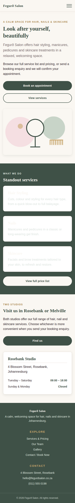
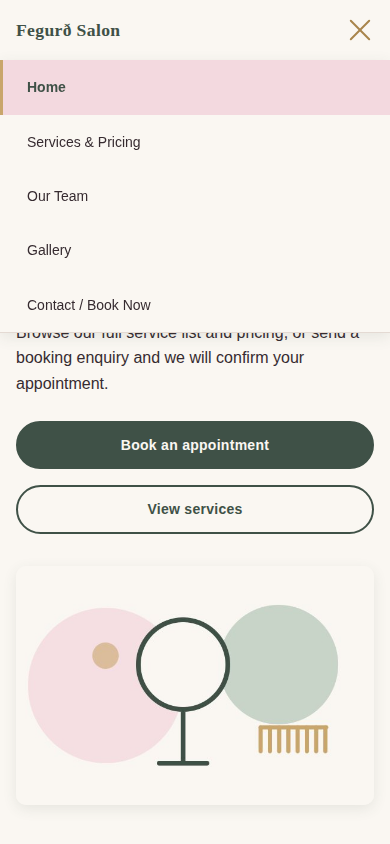
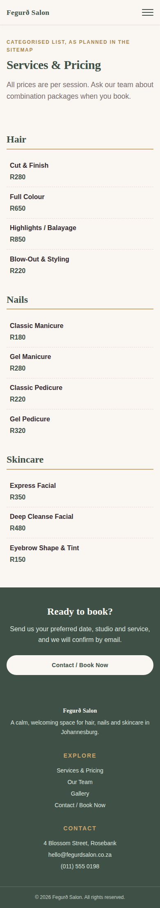
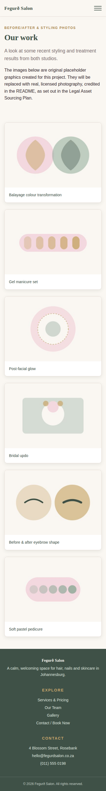
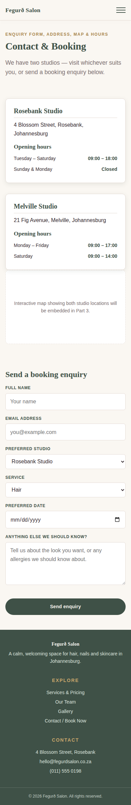

# Fegurð Salon - Website

**WEDE5020 Web Development (Introduction) - Portfolio of Evidence**

## Student Information
- **Name:** Alicia B Bukitu
- **Student Number:** ST10538583
- **Module:** Web Development (Introduction) - WEDE5020
- **Lecturer:** Lwazi Maqoqa

---

## Project Overview
Fegurð Salon is a small, service-based beauty salon offering hair styling,
manicures, pedicures and basic skincare treatments across two Johannesburg
studios. The salon previously relied on walk-ins and telephone bookings
only, with no way for clients to view services, pricing, or request an
appointment online.

This project delivers a five-page website so that clients can browse
services and pricing, meet the team, view past work, and send a booking
enquiry - reducing telephone dependency and giving the salon a stronger
first impression online.

---

## Website Goals and Objectives
- Clearly present the full list of services and pricing.
- Introduce stylists and therapists to build trust with new clients.
- Provide a simple way for clients to request or enquire about a booking.
- Reflect the salon's brand through a clean, calming visual design.

**Success indicators:** number of booking enquiries submitted; increase in
new clients who mention finding the salon online; time spent on the
services and pricing page; positive feedback on how easy it is to find
pricing and book.

---

## Key Features and Functionality
- Five pages: Home, Services & Pricing, Our Team, Gallery, Contact / Book Now.
- Categorised services list with pricing (Hair, Nails, Skincare).
- Team profile cards for each stylist and therapist.
- Gallery of styling and treatment work, using responsive images.
- Booking enquiry form covering both studio locations, with studio,
  service and date selection.
- Consistent header, navigation and footer across all pages.
- Fully responsive layout with a collapsible navigation menu on mobile.
- *(Planned for Part 3: form validation and submission handling, an
  embedded map showing both studios, a gallery lightbox, a search feature
  and SEO optimisation.)*

---

## Technologies Used
| Technology | Purpose |
|---|---|
| HTML5 | Page structure and semantic content |
| CSS3 | Styling, layout (Flexbox and Grid) and responsive design |
| JavaScript | Minimal at this stage; expanded in Part 3 |
| Git / GitHub | Version control and submission |
| Google Fonts | Cormorant Garamond and Karla typefaces |

---

## Timeline and Milestones
| Milestone | Status | Target |
|---|---|---|
| Website Project Proposal approved | Complete | Before Part 1 due date |
| Content research and sourcing | Complete | Alongside proposal drafting |
| HTML foundation (5 pages) built and pushed | Complete | Part 1 |
| CSS styling and responsive design | Complete | Part 2 |
| JavaScript functionality and SEO | Planned | Part 3 |

---

## Sitemap
```
Home
├─ Services & Pricing
├─ Our Team
├─ Gallery
└─ Contact / Book Now
```

- **Home** (`index.html`) - hero banner, brief introduction, standout
  services, studio details
- **Services & Pricing** (`services.html`) - categorised list (hair, nails,
  skincare) with prices
- **Our Team** (`team.html`) - stylist and therapist profiles
- **Gallery** (`gallery.html`) - styling and treatment results
- **Contact / Book Now** (`contact.html`) - enquiry form, both addresses,
  map placeholder and opening hours

---

## File and Folder Structure
```
fegurd-salon/
├─ index.html
├─ services.html
├─ team.html
├─ gallery.html
├─ contact.html
├─ css/
│   └─ styles.css
├─ js/
│   └─ main.js
├─ images/
│   └─ products/        
├─ content-research/
│   ├─ images/
│   ├─ documents/
│   └─ text/
└─ README.md
```

---

## Part 1 Details - Building the Foundation
Part 1 covered project initiation and planning: the Website Project
Proposal (two organisations proposed, Fegurð Salon approved), content
research and sourcing, the sitemap, the file and folder structure, and the
initial HTML foundation for all five pages with working navigation and
explanatory code comments.

## Part 2 Details - Designing the Visuals
Part 2 applies CSS styling and responsive design to the Part 1 foundation.
The visual identity established in Part 1 has been retained and refined
rather than replaced.

### External stylesheet
A single external stylesheet, `css/styles.css`, is linked from all five
pages using a consistent naming convention. All presentational styling
lives in this one file, so no inline or embedded styles are used for
layout or decoration.

### Base styles and CSS reset
A reset at the top of the stylesheet removes inconsistent browser defaults
for margins, padding, box sizing, list styling and media elements. Site
defaults are then established for font family, font size, line height,
colour scheme and spacing. Design tokens are declared as custom properties
on `:root`, which takes advantage of the cascading nature of CSS: a value
such as a brand colour or spacing step is declared once and inherited
throughout, keeping the number of selectors to a minimum.

### Typography
Headings use Cormorant Garamond and body copy uses Karla, both served from
Google Fonts. A modular type scale is defined in `rem` units, alongside
`font-weight`, `line-height` and `letter-spacing` values. Paragraphs are
capped at `65ch` to keep line length comfortable to read.

### Layout structure
Flexbox is used for one-dimensional rows - the header, the navigation list
and button groups. CSS Grid is used for two-dimensional layouts - the card
grids, the gallery, the two-column splits and the footer. Properties used
include `display`, `flex-direction`, `justify-content`, `align-items`,
`grid-template-columns` and `gap`.

### Visual styles and pseudo-classes
`color`, `background-color`, `border`, `border-radius` and `box-shadow`
give the site its finished appearance. Interactive elements use the
`:hover`, `:focus-visible` and `:active` pseudo-classes: navigation links
underline in gold on hover, buttons lift and change shade, cards raise on
hover, service rows tint blush, and form fields show a clear focus ring.
`:focus-visible` is used rather than `:focus` so that a visible outline
appears for keyboard users without showing on mouse clicks.

### Responsive design
Two breakpoints are used: **900px (tablet)** and **600px (mobile)**.

| Adjustment | Tablet (≤900px) | Mobile (≤600px) |
|---|---|---|
| Layout | Three-column grids become two; splits and hero stack | Everything collapses to a single column |
| Typography | Type scale reduced via custom properties | Type scale reduced further |
| Navigation | Spacing tightened so links still fit | Links collapse behind a hamburger toggle and stack vertically |
| Images | Scale fluidly within their grid cell | Full-width within the single column |

Relative units are used throughout: `rem` for font sizes and spacing, `%`
and `fr` for widths, and `ch` for text measure. Images use the `srcset`
and `sizes` attributes so the browser downloads a file appropriate to the
viewport, with `loading="lazy"` on off-screen gallery images. The mobile
navigation toggle is implemented in CSS only, using a hidden checkbox, so
it works without JavaScript.

### Testing
The site was tested at desktop, tablet and mobile viewport widths using
browser developer tools. One issue was identified and corrected during
testing: card text inside the dark green band inherited the band's light
text colour and became unreadable against the white card background. The
colour rules were re-scoped so cards retain dark text wherever they appear.

---

## Screenshot Evidence

### Desktop (1440px)
![Home page on desktop]

![Services page on desktop]

![Team page on desktop]

![Gallery page on desktop]

![Contact page on desktop]


### Mobile (390px)






---

## Changelog

### Part 2 — Designing the Visuals (CSS styling and responsive design)
| # | Change | Detail |
|---|---|---|
| 2.1 | Rewrote `css/styles.css` as the site's single external stylesheet | Organised into seven commented sections: reset, design tokens, base styles, typography, layout, components, responsive design. Linked from all five pages. |
| 2.2 | Added a CSS reset | Normalises margins, padding, `box-sizing`, list styles, form control fonts and media element defaults so rendering is consistent across browsers. |
| 2.3 | Established base/default styles | Site-wide font family, font size, line height, colour scheme and spacing scale, declared as custom properties on `:root` and inherited via the cascade. |
| 2.4 | Applied typography styles | Modular `rem`-based type scale; `font-family`, `font-weight`, `line-height` and `letter-spacing` set for all headings, body copy, labels and the `.eyebrow` label style. |
| 2.5 | Built the layout structure | Flexbox for the header, navigation and button groups; CSS Grid for card grids, the gallery, two-column splits and the footer. |
| 2.6 | Applied visual styling | Brand colour scheme, borders, border radii and layered box shadows; alternating sage and blush section bands to break up long pages. |
| 2.7 | Added pseudo-class states | `:hover`, `:focus-visible` and `:active` on navigation links, buttons, cards, service rows and form fields. `:focus-visible` used so keyboard users get a visible outline without it appearing on mouse clicks. |
| 2.8 | Implemented responsive breakpoints | Media queries at 900px (tablet) and 600px (mobile); multi-column layouts collapse progressively to a single column. |
| 2.9 | Made typography responsive | Type scale custom properties are redefined inside each media query, so every heading and label rescales from one change. |
| 2.10 | Made the navigation menu responsive | Links collapse behind a CSS-only hamburger toggle on mobile, driven by a hidden checkbox; the bars animate into an X when open and the menu stacks vertically. |
| 2.11 | Made images responsive | Added `srcset` and `sizes` to the hero and all six gallery images (three widths each), plus `max-width: 100%`, `height: auto`, `aspect-ratio` and `object-fit: cover`. Off-screen gallery images use `loading="lazy"`. |
| 2.12 | Replaced inline SVG placeholders with image files | Gallery and hero now use real image files at multiple resolutions, so responsive image techniques could be demonstrated properly. |
| 2.13 | Removed inline styles from the HTML | Presentational inline `style` attributes carried over from Part 1 were replaced with reusable classes, keeping all styling in the external stylesheet. |
| 2.14 | Added an accessibility preference query | A `prefers-reduced-motion` media query disables transitions for users who have requested reduced motion at system level. |
| 2.15 | Fixed a contrast defect found during testing | Card text inside the dark sage band inherited the band's light text colour and was unreadable on the white card background; the colour rules were re-scoped so cards keep dark text. |

### Part 1 feedback
> **To complete before submission:** list each point of lecturer feedback
> received on Part 1 and the specific change made in response. Marks are
> awarded for how detailed and well-documented these entries are, so each
> entry should name the feedback point and the corresponding edit.

| # | Feedback received | Change made |
|---|---|---|
| 1.1 | *Good work* | *No changes were made in the first overall feedback* |
| 1.2 | *50 / 50 - 100 %* | *No changes were made in the first overall feedback* |

### Part 1 — Building the Foundation
| # | Change | Detail |
|---|---|---|
| 1.0 | Initial commit | Part 1 HTML foundation for all five pages, external stylesheet linked, navigation working across the site, content research package compiled, README created. |

---

## References

Google Fonts. n.d. *Cormorant Garamond*. [Online]. Available at:
https://fonts.google.com/specimen/Cormorant+Garamond [Accessed 18 September 2026].

Google Fonts. n.d. *Karla*. [Online]. Available at:
https://fonts.google.com/specimen/Karla [Accessed 18 September 2026].

Driscoll, S. 2026. Web Developer. *Salem Press Encyclopedia*. [Online].
Available at: https://research-ebsco-com.ezproxy.iielearn.ac.za/c/5yuqi5/search/details/qvo2q5g4hz
[Accessed 3 August 2026].

Mozilla. n.d. *CSS: Cascading Style Sheets*. MDN Web Docs. [Online].
Available at: https://developer.mozilla.org/en-US/docs/Web/CSS
[Accessed 18 September 2026].

Mozilla. n.d. *Responsive images*. MDN Web Docs. [Online]. Available at:
https://developer.mozilla.org/en-US/docs/Web/HTML/Responsive_images
[Accessed 18 September 2026].

Mozilla. n.d. *Using media queries*. MDN Web Docs. [Online]. Available at:
https://developer.mozilla.org/en-US/docs/Web/CSS/CSS_media_queries/Using_media_queries
[Accessed 18 September 2026].

W3C. 2018. *Web Content Accessibility Guidelines (WCAG) 2.1*. [Online].
Available at: https://www.w3.org/TR/WCAG21/ [Accessed 18 September 2026].

> **Note on imagery:** the gallery and hero images are original graphics
> created for this project using AI, so no third-party image licences apply at
> present. If they are replaced with stock photography, each photograph
> must be credited here with the photographer's name (Alicia B Bukitu), source and licence
> type, as set out in the Legal Asset Sourcing Plan in the Website Project
> Proposal.
